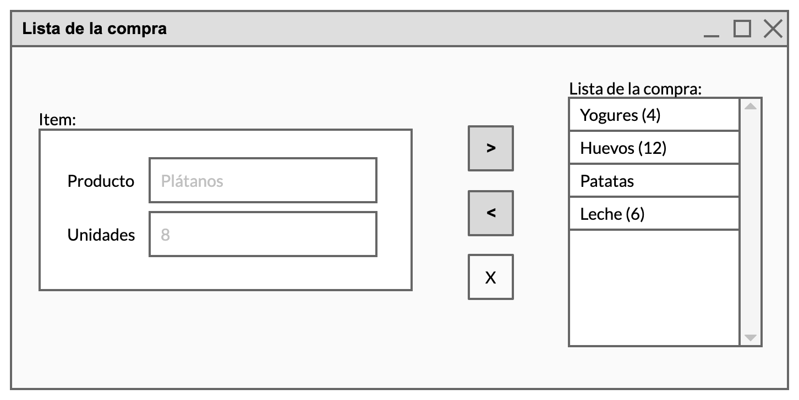

# Lista de la compra

Crea una aplicación que permita mantener la lista de la compra semanal.

La aplicación tiene que tener una ventana como esta:



Y realizar las siguientes acciones:

- Al iniciarse, la lista aparecerá vacía.
- Al pulsar el botón `>` recogerá los datos que haya escrito el usuario y añadirá un `Item` a la lista.

    ```plantuml
    @startuml
    skinparam classAttributeIconSize 0
    
    class Item {
    - producto: String
    - unidades: int = 0
    }
    
    @enduml
    ```

- La inserción se hace detrás del elemento seleccionado o, si no hay ninguno marcado, en última posición.
- El número de unidades es opcional: si es 0 no se mostrará el número en la lista.
- Al pulsar el botón `<` el elemento seleccionado se eliminará de la lista y su contenido se copiará en los cuadros de texto para poder editarlo.
- El botón `X` elimina el elemento seleccionado actualmente en la lista.

## Restricciones

- La lista tiene que estar configurada para permitir seleccionar un solo elemento cada vez.
- La lista tiene que tener barra de _scroll_.
